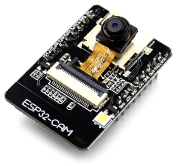

This project is stopped and replaced by the [Stendarr](https://github.com/Cyril-Meyer/Stendarr) project.

# Housecarl
ESP32-CAM security camera

## How it works
This project was created to use an ESP32-CAM as a low cost security IP camera. If you just want to use it as is, here is the basic instructions :
1. Buy and ESP32-CAM (+/- 6€ shipping included), an FTDI programmer, a 5V supply voltage, and a micro SD card. Total +/- 12€.
2. Check [randomnerdtutorials.com](https://randomnerdtutorials.com/) tutorial to know how to burn program from arduino IDE to ESP32-CAM using FTDI programmer.
3. Edit configuration.h file to match your own setup
4. Enjoy

## Todo list
* Debug
  * SD card saves doesn't work after +/- 1.5Gb of data
* Improvemenet
  * Server very slow
  * Copy image into a NAS
  * Loop save of files

## Warning
This project is not currently (and probably never) production ready. You can see some bugs I know in the Todo list but there is probably more of them.
